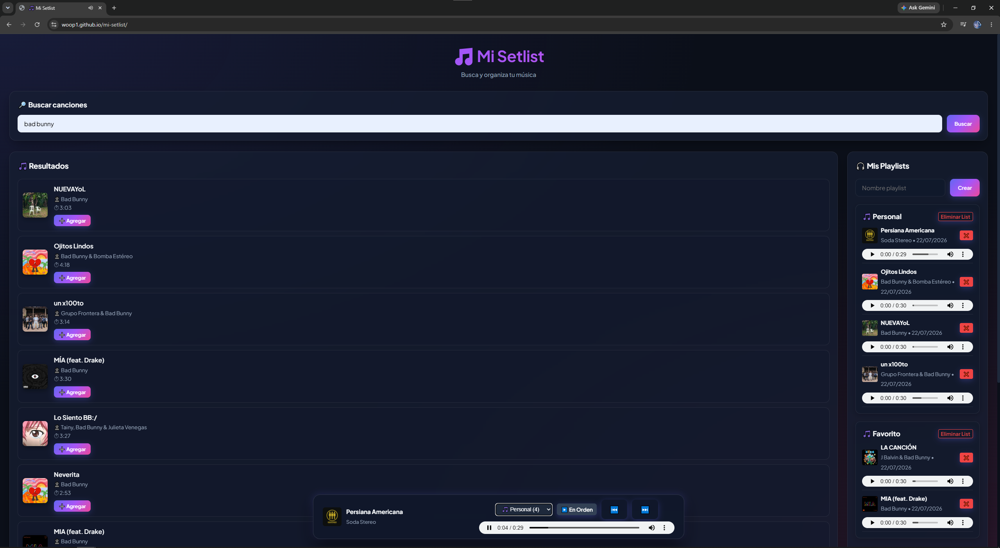

# 🌐 Deploy

👉 [https://woop1.github.io/mi-setlist/](https://woop1.github.io/mi-setlist/)

---

# 🎵 Mi Setlist

Aplicación web que permite buscar canciones usando la API de iTunes, crear playlists personales, organizarlas y reproducirlas de forma continua con un reproductor global interactivo, manteniendo la persistencia de datos en el navegador.

## 👁️ Vista Previa

<p align="center">
  
</p>

## 🚀 Stack utilizado

- HTML5
- CSS3 (Estética Dark Neón y Glassmorphism)
- JavaScript Vanilla con módulos ESM
- iTunes Search API (con reproducción de audio preview de 30s)
- LocalStorage para persistencia de datos
- GitHub Pages para despliegue

## 📖 Historias de Usuario

Las historias de usuario del proyecto se encuentran en:

[HISTORIA.md](HISTORIA.md)

Principales funcionalidades:

- Buscar canciones por nombre o artista.
- Mostrar información y carátulas de canciones.
- Crear playlists personalizadas.
- Agregar canciones a playlists específicas.
- Ver canciones dentro de una playlist.
- Eliminar canciones y playlists.
- Mostrar estadísticas detalladas de la música.
- Guardar playlists al recargar la página.
- **Reproductor Global Multimedia (HU9):** Reproducción continua, cambio entre modos "En Orden" y "Aleatorio (Shuffle)", y barra flotante centrada interactiva.

## 💻 Cómo ejecutar el proyecto localmente

1. Clonar el repositorio:

```bash
git clone https://github.com/woop1/mi-setlist.git